# 이리5조 - Setak D`Gaja
******************
👀 프로젝트 완성본 기술 시연 https://wth2052.tistory.com/163  
👀 최종 프로젝트 KPT 회고 https://wth2052.tistory.com/161
******************
## Setak D`GaJa 팀원 소개 및 역할 분담


우주천재 우주최강 우태현(조장), 성민섭, 이한결, 이드보라, 장승윤

- 역할 분담
    - 사장님1 사장님2 - 우태현 이한결
    - 고객1 고객2 - 성민섭 장승윤
    - 회원가입 로그인 - 이드보라
    - 테스트 코드 작성 - 다같이

## 프로젝트 개요 D` Gaja

- 우주천재 우태현
    
    ㄴ저도 알고있습니다. 감사합니다 :태현
    
    범인 : 우태현을 제외한 4명중 1명
    
    팀장님 화이팅
    
- 
    - 요구사항을 받은대로 기능 구현 연습
    

## 협업 도구 D` Gaja

- 
    - Github
    - Notion
    
## ENV 설정

- 
    - MYSQL_USERNAME=root
    - MYSQL_PASSWORD=PWD
    - MYSQL_DATABASE=ENVNAME
    - MYSQL_DATABASE_TEST = test
    - MYSQL_DIALECT=mysql
    - MYSQL_HOST=ORMHOST
    - MYSQL_DIALECT=mysql
    - JWT_SECRET=customized-secret-key
    - ENVTEST = "ENV가 잘 로딩되었어요"
    - keyForDecrypt=customized-secret-key
    - NODE_ENV = TEST


## 통일 사항 D` Gaja

- 
    - 카멜 케이스
    - 색상 (프론트 제작시)
        
        #0099A4
        #FFE2D2
        #CDE5EE
        #FA6616
        

## 주의 사항 D` Gaja

- 
    
    ### **풀 리퀘스트가 끝난 후 Delete Branch를 해서 가지치기를 해줄것**
    

## 와이어 프레임 D` Gaja

- **와이어프레임 열기**
    
    **링크 :** [https://drive.google.com/file/d/16VX2QxPXD871N594V-53O8bGfk74S3-H/view?usp=sharing](https://drive.google.com/file/d/16VX2QxPXD871N594V-53O8bGfk74S3-H/view?usp=sharing)
    
    토글 전체 열기 : ctrl + alt + t
    
    - **회원가입(사장)**
        
        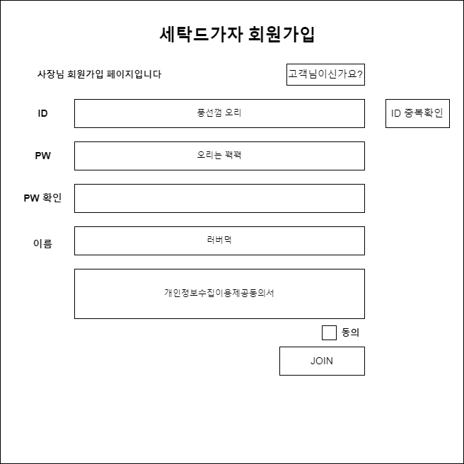
        
    
    - **회원가입 (손님)**
        
        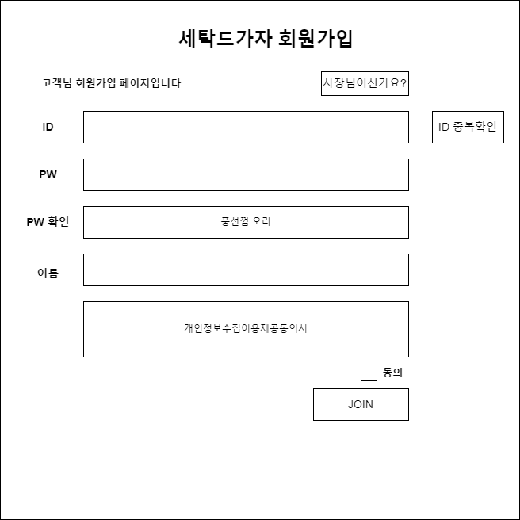
        
    
    - **로그인(손님)**
        
        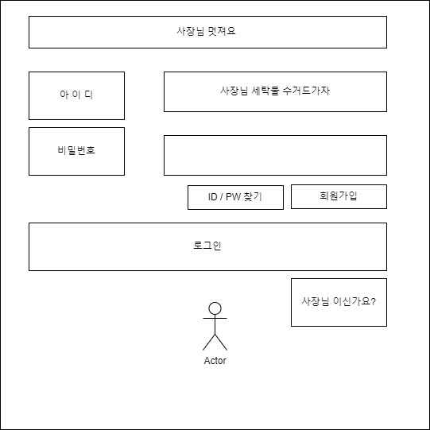
        
    
    - **로그인(사장)**
        
        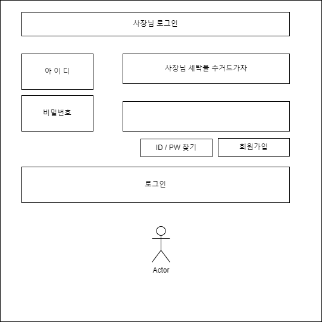
        
    
    - **마이페이지(손님)**
        
        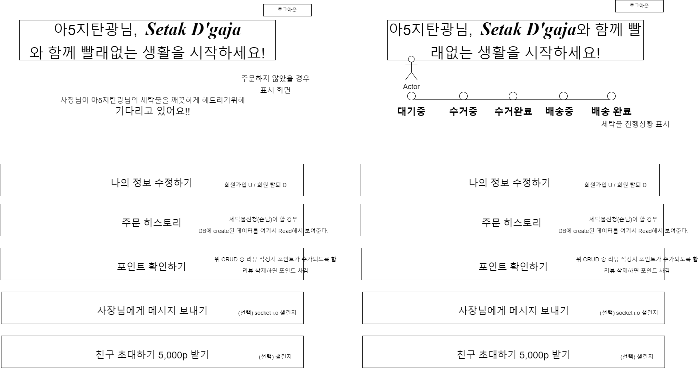
        
    
    - **마이페이지(사장)**
        
        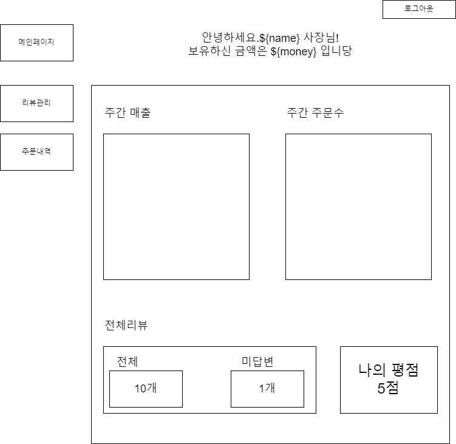
        
    
    - **리뷰(모달)**
        
        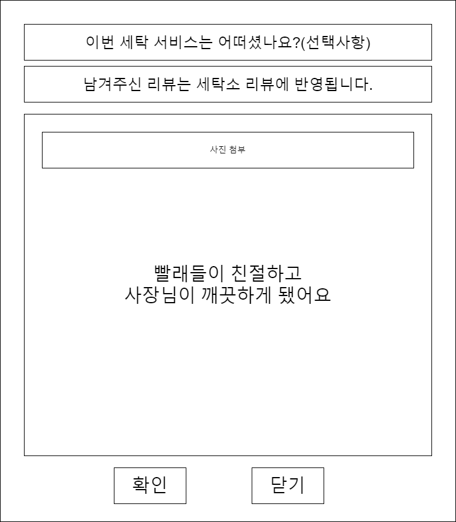
        
    
    - **주문 내역(사장)**
        
        
        
    
    - **주문 히스토리(손님)**
        
        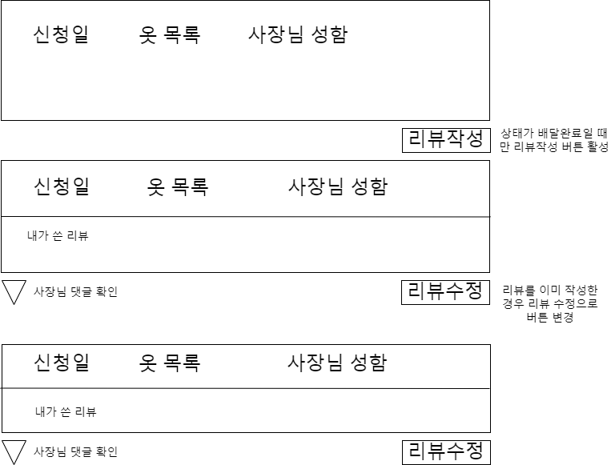
        
    
    - **세탁물 신청(손님)**
        
        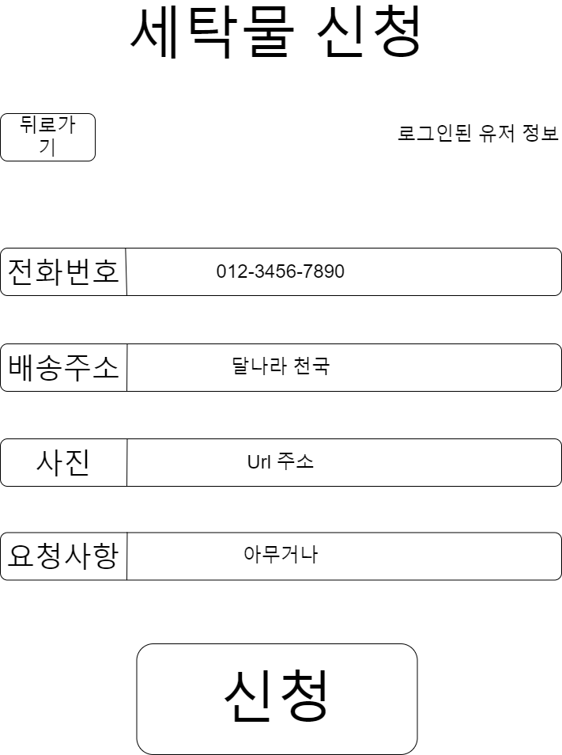
        
    
    - **세탁물 수거(사장)**
        
        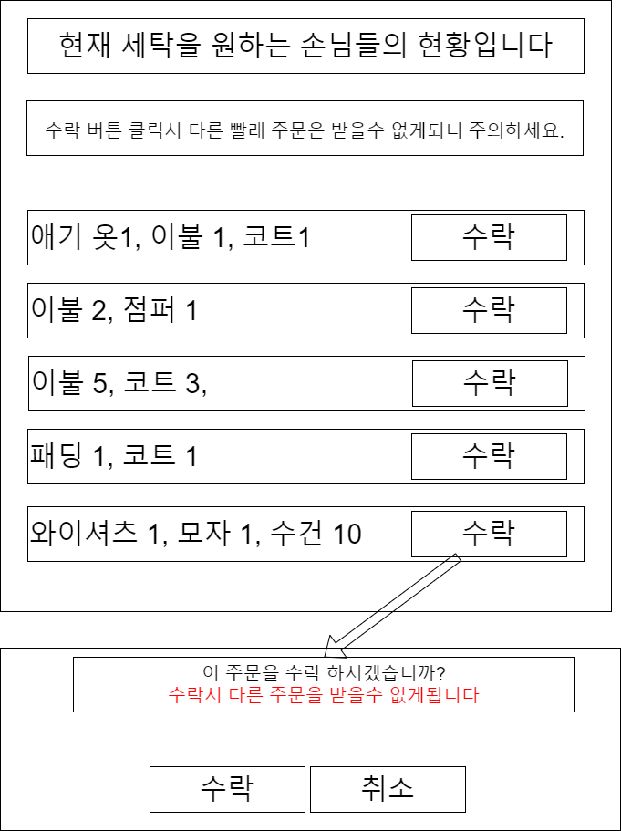
        
    
    - **메인페이지**
        
        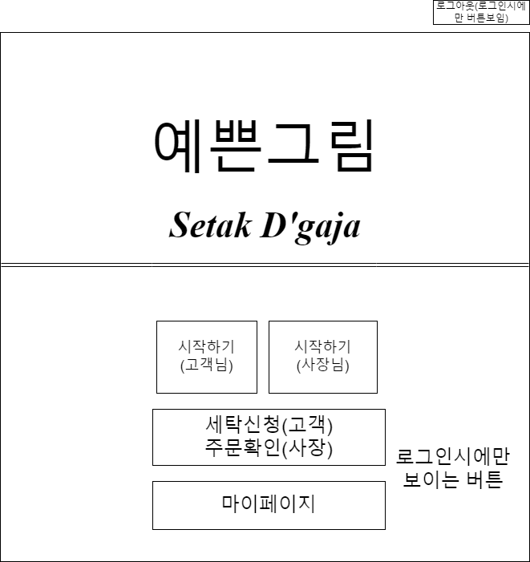
        
    

## 요구사항 D` Gaja

1. 회원가입 (이 때, 손님으로 회원가입) → 회원가입 완료시 1,000,000P 지급
- 손님
    1. 로그인 / 로그아웃
    2. 세탁 서비스 신청하기
        1. 잔여 포인트가 10,000P 미만이면 세탁 서비스를 신청할 수 없습니다.
        2. **세탁 서비스를 신청**할 시에 **10,000P(세탁비)가 깎입니다.**
        3. 세탁 서비스 신청할 때는 다음과 같은 정보들을 입력을 받아야 합니다.
            1. 손님 닉네임
            2. 손님 전화번호
            3. 손님 집 주소
            4. 손님 세탁물 사진
            5. 세탁 요청사항
    3. 내가 신청한 세탁 서비스 상태 파악
        1. `대기 중`
            1. 사장님 중 아무도 손님의 세탁물 수거를 신청하지 않은 상황
        2. `수거 중`
            1. 사장님 중 한 분이 세탁물 수거를 신청하여 수거를 하러 가는 상황
        3. `수거 완료`
            1. 사장님이 수거를 완료한 상황
        4. `배송 중`
            1. 사장님이 세탁을 완료하고 배송 중인 상황
        5. `배송 완료`
            1. 사장님이 손님의 집 앞으로 세탁물을 배송 완료한 상황
    4. 세탁 서비스 평점 및 리뷰 작성
        1. 해당 기능은 사용자가 선택적으로 작성 할 수 있어야 합니다. 의무는 아닙니다.
- 사장님
    1. 회원 가입 (이 때, 사장님으로 회원가입) → 회원 가입 시 0P 지급
    
    1. 로그인 / 로그아웃
    2. 손님들이 신청한 세탁물 조회
    3. 조회된 세탁물 중 하나를 세탁 진행
        1. 사장님이 2개 이상 “세탁 진행”을 할 수 없게끔 합니다. 오로지 하나만 세탁할 수 있습니다.
    4. 작업 중인 세탁물 상태 업데이트
        1. 사장님은 `수거 완료` → `배송 중` → `배송 완료`의 3단계로 세탁 상태를 업데이트 할 수 있습니다.
        2. 오로지 위에 나온 순서대로 세탁 상태를 업데이트 할 수 있으며 **그 외의 상태 업데이트는 금지**합니다.
        3. `배송 완료`를 누르면 **10,000P를 입금** 받습니다.
    5. 본인의 세탁 서비스 평점 및 리뷰 조회

## API 명세 D` Gaja

- [https://docs.google.com/spreadsheets/d/1URHwbH3DXJ6oOZ9qRqSzj8GDuI0Qo4fJEI5GZwnrIaA/edit#gid=0](https://docs.google.com/spreadsheets/d/1URHwbH3DXJ6oOZ9qRqSzj8GDuI0Qo4fJEI5GZwnrIaA/edit#gid=0)
    
    [API ](https://www.notion.so/1cceb3ff7bf447b390d9cb6552f3f1c0)
    

## DB 설계 D` Gaja

- 디비는 외주로
    - 
    
    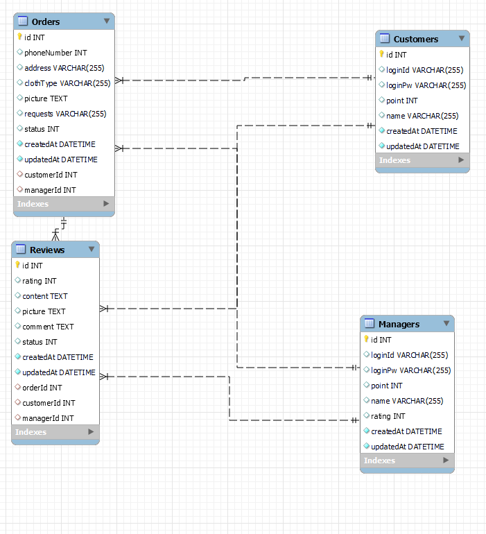
    

## 폴더 구조  D` Gaja

- 텍스트 폴더 구조
    
    |   .env
    |   .gitignore
    |   .prettierrc.js
    |   app.js
    |   jest.config.js
    |   package-lock.json
    |   package.json
    |
    +---auth-middleware
    |       auth-middleware.js
    |
    +---config
    |       config.js
    |
    +---controllers
    |       customer.controller.js
    |       manager.controller.js
    |       orders.controller.js
    |       review.controller.js
    |
    +---migrations
    |       20221231143310-create-customer.js
    |       20221231143331-create-manager.js
    |       20221231143422-create-order.js
    |       20221231143444-create-review.js
    |       20230101114255-order-customer-manager-association.js
    |       20230101114459-review-customer-manager-order-association.js
    |
    +---models
    |       customer.js
    |       index.js
    |       manager.js
    |       order.js
    |       review.js
    |
    +---repositories
    |       customer.repository.js
    |       manager.repository.js
    |       order.repository.js
    |       review.repository.js
    |
    +---routes
    |       customer.routes.js
    |       index.js
    |       manager.routes.js
    |       order.routes.js
    |       pageranderouter.js
    |       review.routes.js
    |
    +---services
    |       customer.service.js
    |       manager.service.js
    |       order.service.js
    |       review.service.js
    |
    +---static
    |   \---css
    |           boards.css
    |           css.css
    |           css2.css
    |           index.css
    |           nav.css
    |           reset.css
    |           sorting.css
    |           variable.css
    |
    +---views
    |   |   index.ejs
    |   |   login.ejs
    |   |   loginCustomer.ejs
    |   |   loginManager.ejs
    |   |   main.ejs
    |   |   main.html
    |   |   manager.ejs
    |   |   managerSelect.ejs
    |   |   me copy.ejs
    |   |   me.ejs
    |   |   meManager.ejs
    |   |   mypage copy.ejs
    |   |   mypage.ejs
    |   |   nav copy.html
    |   |   nav.html
    |   |   order.ejs
    |   |   orderHistory.ejs
    |   |   orderlist.ejs
    |   |   orderPost.ejs
    |   |   orderview copy.ejs
    |   |   orderview.ejs
    |   |   sample.ejs
    |   |   signup.ejs
    |   |   signupManager.ejs
    |   |
    |   \---js
    |           order.js
    |
    \---
    
    **tests**
    
    |   .DS_Store
    |
    +---grammars
    |       grammars.spec.js
    |
    +---integration
    |       customer.integration.spec.js
    |       manager.integration.spec.js
    |       order.integration.spec.js
    |       review.integration.spec.js
    |
    \---unit
    customer.controller.unit.spec.js
    customer.repository.unit.spec.js
    customer.service.unit.spec.js
    manager.controller.unit.spec.js
    manager.repository.unit.spec.js
    manager.service.unit.spec.js
    order.controller.unit.spec.js
    order.repository.unit.spec.js
    order.service.unit.spec.js
    review.controller.unit.spec.js
    review.repository.unit.spec.js
    review.service.unit.spec.js
    

## 사용 기술 스택 D` Gaja

- 
    - Front : EJS, CSS, Javascript, Bootstrap(제작시)
    - Back : JavaScript, Node.js, Express, jest
    - Database: MySQL(Sequelize ORM)

## 작업 히스토리 D` Gaja

- 2022.12.30
    - [1차 다이어그램 제작](https://app.diagrams.net/#G16VX2QxPXD871N594V-53O8bGfk74S3-H)
    - 
    - 
- 2023.01.02
    - 기능 구현 약 7-80%완료, 내일 합친 후 기능 최종점검, 테스트코드 작성
- 2023.01.03
    - 기능 구현 완료, FRONT SIDE 구현 시작, 테스트 코드 작성중
- 2023.01.04
    
    유닛 테스트 코드 작성중, 프론트 구현 중, 코드 작동 확인
    
- 2023.01.05
    
    유닛 테스트 코드 작성, 프론트 구현 중, 예외처리 마무리
    
- 2023.01.06
    
    완성 : 백엔드/유닛 테스트
    
    미완성 : 프론트/문법/통합 테스트
    

## 미구현 기능

- 
    
    
    1. 주문페이지에서 리뷰작성 X
    2. 사장님이 리뷰에 대한 대댓글 작성 X
    3. 사장님 로그인시 손님의 마이페이지로 접속시 서버가 다운됩니다. (에러미처리)
    4. 회원 로그인 시 사장님의 마이페이지로 접속시 서버가 다운됩니다 (에러미처리)
    5. 사장님의 주문 상태 업데이트 기능 미구현

## 코드 소개 D` Gaja

- 우태현
    
    20230101114255-order-customer-manager-association.js
    
    db의 관계를 사전에 정의하고 마이그레이션 해본적은 처음이었어서 이렇게 작성후 마이그레이션시
    
    워크벤치에서 db간의 관계가 정의가능하다는것이 너무 신기했습니다.
    
    ```jsx
    'use strict';
    
    /** @type {import('sequelize-cli').Migration} */
    module.exports = {
      async up(queryInterface, Sequelize) {
        await queryInterface.addConstraint('Orders', {
          fields: ['customerId'],
          type: 'foreign key',
          name: 'order_customer_association',
          references: {
            table: 'Customers', //  table이름은 DB에서  복수형이고, 대문자로 시작하는 것을 명심
            field: 'id',
          },
        });
        await queryInterface.addConstraint('Orders', {
          fields: ['managerId'],
          type: 'foreign key',
          name: 'order_manager_association',
          references: {
            table: 'Managers', // table이름은  DB에서복수형이고, 대문자로 시작하는 것을 명심
            field: 'id',
          },
        });
      },
    
      async down(queryInterface, Sequelize) {
        await queryInterface.removeConstraint(
          'Orders',
          'order_customer_association',
        );
        await queryInterface.removeConstraint(
          'Orders',
          'order_manager_association',
        );
      },
    };
    ```
    
- 이드보라
    
    auth middleware에서 손님과 사장님을 어떻게 구분해야할지 너무 고민이었는데 승윤님의 도움으로 해결해서 기분이 좋았습니다. 
    
    <aside>
    💡  아닙니당. 저는 한 게 없습니다. 저는 한 마디만 했을 뿐인데 드보라님께서 워낙 똑똑하셔서 알아서 다 만들어주셨습니다.  -sy
    
    </aside>
    
    ```jsx
    try {
      // 복호화 및 검증
      const {id,member} =jwt.verify(token,process.env.JWT_SECRET);
    
      if (member=== 'customer'){
    Customer.findByPk(id).then((customer) => {
    req.customer =customer;
          returnnext();
        });
      } else if (member=== 'manager'){
    Manager.findByPk(id).then((manager) => {
    req.manager =manager;
          returnnext();
        });
      }
    
    ```
    
    그리고 실제 기능에서는 
    
    `if(*req*.manager && *req*.manager.id)`
    
    를 사용해서 걸러주었는데 실제로 구현 성공했을 때 아주  짜릿했습니당
    
    좋습니다
    
- 이한결
    
    unit 테스트를 할때 실제 작동이 되야하는 함수들을 가짜함수로 만들어서 테스트를 하면서 3계층의 각부분이 어떻게 동작되는 알 수 있어서 선택했습니다.
    
    ```jsx
    mockCustomerService.customerSignup = jest.fn(() => customerSignupValue);
    
        await customerController.customerSignup(mockRequest, mockResponse);
    
        expect(mockCustomerService.customerSignup).toHaveBeenCalledTimes(1);
        expect(mockResponse.status).toHaveBeenCalledTimes(1);
        expect(mockResponse.status).toHaveBeenCalledWith(201);
    
        expect(mockResponse.send).toHaveBeenCalledWith({
          message: '회원가입 완료!'
        });
    ```
    
- 성민섭
    
    ```jsx
    test('주문 상세 조회 테스트(getOrderById)', async () => {
      mockRequest.params = { orderId: 1 };
      mockRequest.headers = { cookie: "test" };
    
      const orderById = 1;
      mockOrderService.findOrderById = jest.fn(() => {
        return orderById;
      });
    
      const cookie = 'test';
      mockOrderService.findOrderById = jest.fn(() => {
        return cookie;
      });
    
      await orderController.getOrderById(mockRequest, mockResponse);
      expect(mockOrderService.findOrderById).toHaveBeenCalledTimes(1);
      expect(mockResponse.status).toHaveBeenCalledTimes(1);
      expect(mockResponse.status).toHaveBeenCalledWith(200);
    });
    ```
    
    jest.fn() 함수를 활용하여 임의의 함수를 실행해서 테스트는 하는게 재밌었습니다.
    다음 프로젝트에서는 조금 더 명확한 변수명을 사용하고, 기능을 만들 때 마다
    테스트 코드를 작성하면 더 좋을꺼 같다고 느꼈습니다. ❤
    
- 장승윤
    
    
    customer.controller.js
    
    ```jsx
    // Front : 고객 마이페이지용 컨트롤러 만들기 
      getMypage = async (req, res, next) => {
        const customerId = req.customer.id;
        // console.log("컨트롤러", customerId);
    
        const orderByCustomer = await this.orderService.findOrderByCustomer(customerId);
        const { id } = req.customer;
        // console.log("고객아이디", id);
        const customerInfo = await this.customerService.findByPk(id)
    
        // res.status(200).json({ data: orderByCustomer });
        // const data = res.locals;
        const token = req.headers.cookie.split('=')[1];
        // res.locals.token = token;
    
        // console.log("쿠키데이타받아보자", token);
        // console.log("컨트롤러", orderByCustomer);
        console.log("고객정보받아보자", customerInfo)
    
        return res.status(200).render('../views/me.ejs', 
    				{ token: token, data: orderByCustomer, customerInfo: customerInfo });
      };
    ```
    
    Front me.ejs
    
    ```html
    <script>
      // const token = Cookies.get('token');
      // const token = req.headers.cookie.split('=')[1];
      const token = '<%- token %>';
      console.log(token);
    
      axios.get('/me', {
        headers: {
          'Authorization': `Bearer ${token}`
        }
      })
      .then((response) => {
        console.log(response.data);  // prints the data returned by the server
      })
      .catch((error) => {
        console.error(error);  // prints the error if the request fails
      });
    </script>
    ```
    
    마이페이지 기능구현에 있어, 백엔드는 Postman에서 잘 작동하였지만,
    
    프론트엔드는 고객이 로그인을 했음에도 불구하고 
    
    화면에서 { 로그인이 필요한 사용자입니다. } 라는 에러 메시지가 뜨는 현상이 발생하였습니다.
    
    이 문제는 프론트엔드에서 로그인한 유저의 토큰을 읽어오지 못하는 현상이었는데
    
    위와 같이 프론트 ejs파일과 백엔드 controller사이에
    
    token을 연결하는 코드를 넣어줌으로서 해결되었습니다.
    
    customer.controller.js 에서 ejs render하면서 token을 함께 넣어주면, 그제야 프론트 EJS파일에서 사용자가 고객이라는 것을 인식하기 시작한 것이 인상적이었습니다.
    

## 완성소감 D`Gaja

- 우태현
    
    협업시에 초석을 단단하게 다져놓고 출발해야 나중에 문제가 없다는걸 알게되었습니다
    
    코.딩.조.아 언제나 고생은 개발자가..
    
    
    
- 이드보라
    
    예외처리는 기능구현과 동시에… 
    
    이번 프로젝트 때 다들 너무 열심히 참여해주시고 계속 응원해주셔서 감사합니다 수고많으셨습니당
    
- 이한결
    
    멘탈 터지는 프로젝트였습니다.
    
    변수,함수 이름은 명확하고 구분이되게 해야한다는것을 배웠습니다.
    
- 성민섭
    
    
    실력부족으로 인한 프로젝트 참여도가 떨어져서 멘탈적으로 많이 힘든
    프로젝트였습니다.
    하지만 팀원분들이 서로서로 응원해주시고, 열심히해주셔서
    좋은결과가 나온거같습니다.
    모두 감사합니다 !! ❤❤
    
- 장승윤
    
    
    이리5조 팀원 분들 만나서 함께 Setak D`gaja 프로젝트 할 수 있어서 배우는 것도 많았고 좋았습니다.  4주간 팀원분들과 즐겁게 코딩할 수 있어서 재밌었습니다. 모두  고생 많으셨고, 함께 해주셔서  감사합니다. 
    
    좋습니다.
    

## 회고


- 우태현
    
    K - 
    
    발표 전날 발표 당일까지 포기하지않고 최대한 완성시킨 끈기
    
    다같이 일하고 다같이 퇴근하는 일심동체
    
    안되면 될때까지 시도하고 시간이 부족하다면 할수 있는데까지 완성했던 도전,실험정신
    
    P - 
    
    협업시 소통은 어느정도 잘 된것 같은데 중간에 변경사항이 조금 많았었음
    
    테스트 코드 작성 시 코드가 실시간으로 변경된적이 종종 있어 테스트 로직을 뒤집었어야 했을때가 있었음
    
    T -
    
    협업시엔 기반을 탄탄히 다져놓은 후(API명세, 와이어프레임(심플하게),역할분배 = 삼위일체)
    
    작업을 추진할 것.
    
    1+1+1+1+1이 5, 50, 500의 시너지를 내는 방법은 소통뿐
    
    나도 틀릴수 있고 남도 틀릴때가 있다
    
    내가 맞을수도 있고 남이 맞을때도 있다
    
    중요한건 역지사지와 경청! 換位思考最重要！
    
- 이드보라
    
    K: 엄청난 소통, 응원과 협력!!
    
    P: 계획이 조금 부족했던 것 같고… 테스트 코드는 기능구현과 동시에 작성을 안해서 문제 발생(예외처리도ㅜㅜㅜ 결국 마지막에 확인해보니 예외처리 안된 기능들 발견)
    
    T: 계획을 조금 더 제대로 하고 테스트코드랑 예외처리는 기능구현과 동시에 꼭 작성하장
    
- 장승윤
    
    K:  모두 열심히 했다.
    
    P: 테스트코드를 해보자
    
    T:  코드를 잘 작성해보자. 
    
- 성민섭
    
    K : 같이 소통하면 더 빨리 해결할수있다.
    P : 중요한건 꺽이지않는 마음! 그리고 강인한 멘탈
    T : 가독성 좋은 코드와 변수명을 항상 사용할수있도록 노력하자.
    
- 이한결
    
    keep : 모르는것은 혼자 고민하지 말자
    
    problem: 모르는것을 물어볼때 구체적으로 물어보자
    
    try: 코드가 어떻게 진행되고 어디서 에러가 나는지 파악하고 물어보려고하자
    

## 민섭’s의 하루 시 D` Gaja

- 어서오고
    
    
    
- 2022.12.30
    
    내가 너를
                                            나태주
    
    **내가 너를**
    
    **얼마나 좋아하는지**
    
    **너는 몰라도 된다**
    
    **너를 좋아하는 마음은**
    
    **오로지 나의 것이요,**
    
    **나의 그리움은**
    
    **나 혼자만의 것으로도**
    
    **차고 넘치니까**
    
    **나는 이제**
    
    **너 없이도 너를**
    
    **좋아할 수 있다.**
    
- 2023.01.01
    
    풀꽃
                                         나태주
    
    자세히 보아야 예쁘다
    
    오래 보아야 사랑스럽다
    
    너도 그렇다
    
- 2023.01.06
    
    
